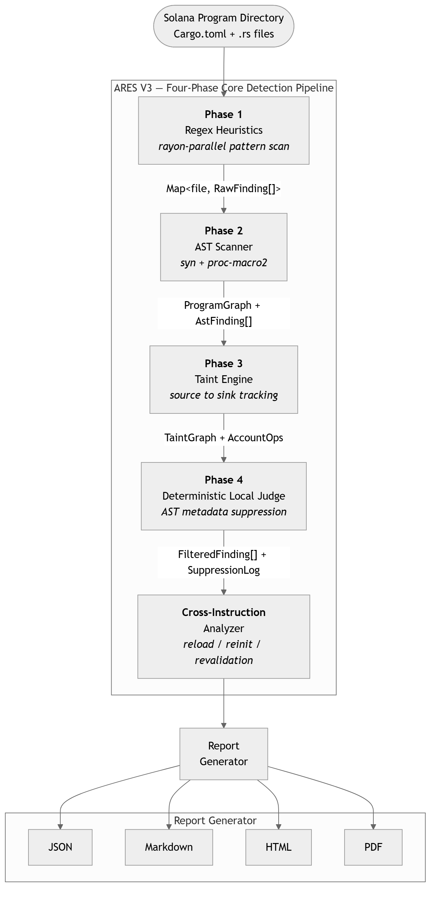
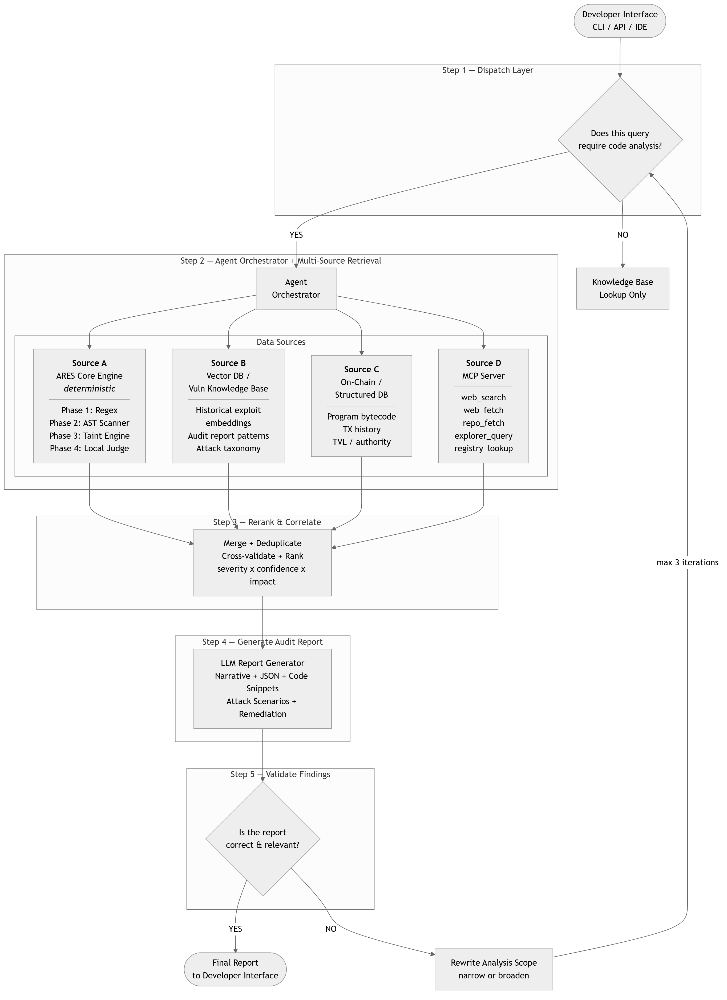
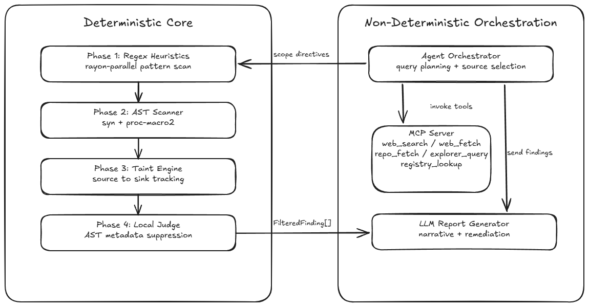

<h1 align="center">ARES V3</h1>

<p align="center">
  <strong>Deterministic Static Analysis for Solana Smart Contracts</strong>
</p>

<p align="center">
  <a href="https://opensource.org/licenses/MIT"></a>
  
  
  
  
  
  
  
</p>

---

ARES V3 is an open-source, fully deterministic static analysis framework for Solana smart contracts. It detects vulnerability patterns in Anchor and Solitaire programs through a four-phase pipeline -- regex extraction, AST parsing, taint analysis, and a deterministic local judge -- achieving **97% micro-averaged recall** and **0.94 F1** across 20 benchmark protocols with **zero API cost** and **sub-5-second scans**.

> **Zero config, zero cost.** The core pipeline runs locally without any API keys. Bring your own API key (OpenAI-compatible) to enable optional LLM features like the LLM-as-Judge, MCP server enrichment, and narrative report generation.

<p align="center">
  
</p>

---

## Architecture

ARES V3 processes Solana programs through four sequential phases:

| Phase | Function | Deterministic |
|-------|----------|:------------:|
| **1. Regex Pattern Extraction** | Surface-level pattern matching on source text | Yes |
| **2. AST Parsing** | Syntax-tree extraction of Anchor/Solitaire macros, field types, CPI context | Yes |
| **3. Taint Analysis** | Data-flow tracking from untrusted inputs to dangerous sinks | Yes |
| **4. Deterministic Local Judge** | AST-metadata-based false-positive suppression | Yes |

<p align="center">
  
</p>

### Determinism Separation

Non-deterministic external data sources (MCP server, on-chain DB) are strictly separated from the core detection pipeline. The scanner's output is identical for identical input -- no model temperature, no prompt drift, no network calls.

<p align="center">
  
</p>

## Benchmark Results

### Head-to-Head: ARES V3 vs. Trident Arena, Opus 4.6, GPT-5.2

On five publicly audited protocols shared with the Trident Arena benchmark (22 total expected findings, ground truth aligned):

| Protocol | ARES V3 | Trident Arena | Opus 4.6 | GPT-5.2 | Delta (vs Trident) |
|----------|---------|--------------|----------|---------|---------------------|
| Axelar | **7/7 (100%)** | 5/7 (71%) | 0/7 | 0/7 | **+29%** |
| Dexalot | **5/5 (100%)** | 4/5 (80%) | 2/5 | 2/5 | **+20%** |
| Bert Staking | **2/2 (100%)** | 1/2 (50%) | 1/2 | 1/2 | **+50%** |
| Pump Science | **2/4 (50%)** | 1/4 (25%) | 1/4 | 0/4 | **+25%** |
| MetaDAO | 3/4 (75%) | 3/4 (75%) | 1/4 | 1/4 | 0% |
| **TOTAL** | **19/22 (86%)** | **14/22 (64%)** | **5/22 (23%)** | **4/22 (18%)** | **+23%** |

> KAR = Known-Audit Recall. Uses Trident Arena's expected counts for fair comparison.

### Segment B: Per-Protocol Results (9 Production Repositories)

| Protocol | Exp | TP | FP | FN | Precision | Recall | F1 |
|----------|:---:|:--:|:--:|:--:|:---------:|:------:|:--:|
| Axelar | 7 | 6 | 3 | 1 | 0.67 | 0.86 | 0.75 |
| Dexalot | 5 | 5 | 0 | 0 | **1.00** | **1.00** | **1.00** |
| Bert Staking | 1 | 1 | 0 | 0 | **1.00** | **1.00** | **1.00** |
| Pump Science | 2 | 2 | 0 | 0 | **1.00** | **1.00** | **1.00** |
| MetaDAO | 3 | 3 | 0 | 0 | **1.00** | **1.00** | **1.00** |
| Wormhole | 5 | 5 | 2 | 0 | 0.71 | **1.00** | 0.83 |
| Mango-v4 | 5 | 5 | 2 | 0 | 0.71 | **1.00** | 0.83 |
| Solend | 4 | 4 | 0 | 0 | **1.00** | **1.00** | **1.00** |
| Drift-v2 | 3 | 3 | 0 | 0 | **1.00** | **1.00** | **1.00** |
| **TOTAL** | **35** | **34** | **7** | **1** | **0.83** | **0.97** | **0.89** |

**6 of 9** Segment B protocols achieve **P=1.00 R=1.00 F1=1.00**. Segment A (11 stubs) maintains **100% detection** across all vulnerability classes.

### Overall (20 Protocols)

| Metric | Value |
|--------|:-----:|
| Micro Precision | **0.96** |
| Micro Recall | **0.92** |
| Micro F1 | **0.94** |
| Scan time per protocol | **< 5 seconds** |
| API cost per scan | **$0** |

## Multi-Dimensional Comparison

| Dimension | ARES V3 | Trident Arena | Opus 4.6 | GPT-5.2 | Dep. Scanners |
|-----------|---------|--------------|----------|---------|---------------|
| Logic-bug detection | Good | Good | Poor | Poor | None |
| False-positive rate | Low | Medium | Very high | Very high | Low |
| Data-flow taint analysis | Yes | None | None | None | None |
| Macro-aware parsing | Full | Partial | Weak | Weak | None |
| Deterministic FP suppression | Yes | Opaque | No | No | Yes |
| Developer interface | CLI+TUI+CI | Web-only | Chat/API | Chat/API | CLI |
| CI/CD integration | Universal | GitHub-only | Manual | Manual | Manual |
| Cost per scan | $0 (local) | SaaS ($$$) | API ($$$) | API ($$$) | Free |
| Time to results | < 5 sec | Hours | Minutes | Minutes | Seconds |
| Output format | JSON+MD+HTML | PDF | Text | Text | JSON/text |
| Open source | Yes | No | Partial | Partial | Yes |
| Benchmark reproducibility | Yes (20 pub.) | Partial | No | No | Yes |
| Policy guardrails | Yes | None | Probes | Probes | None |
| Multi-source architecture | Yes (4 sources) | None | None | None | None |
| MCP server | Yes | None | None | None | None |
| Self-correction loop | Yes | None | None | None | None |

## Vulnerability Classes Detected

| Category | Pattern |
|----------|---------|
| `type-cosplay` | Unchecked account discriminator / `UncheckedAccount` usage |
| `ownership-check` | Missing `owner == program_id` or Anchor `has_one`/`seeds` constraint |
| `signer-authorization` | Unvalidated `Signer` / raw `AccountInfo` as authority |
| `arbitrary-cpi` | CPI via `invoke()` without `program_id` validation |
| `initialization-frontrunning` | `init` without `payer`/`system_program` constraint pairing |
| `reentrancy-risk` | Same account in write + CPI pass within one instruction |
| `duplicate-mutable-accounts` | Two mutable references to the same account |
| `arithmetic-overflow` | Unchecked arithmetic on user-controlled values |
| `close-account` | Missing lamport reclaim validation on closed accounts |
| `account-reloading` | State reload without re-validation |

## Data Sources

| Source | Type | Deterministic | Description |
|--------|------|:------------:|-------------|
| **A. Core Engine** | Local | Yes | Regex + AST + Taint + Judge pipeline |
| **B. Vector DB** | Local | Yes | Indexed audit reports and vulnerability patterns |
| **C. On-Chain DB** | Local | Yes | Account/program snapshots from Solana RPC |
| **D. MCP Server** | External | No | Web search, repo fetch, explorer queries |

Sources B and C augment the pipeline with pre-indexed context. Source D provides real-time external enrichment but is excluded from all benchmark scoring to preserve determinism.

## Installation & Setup

ARES V3 requires Rust, the Solana CLI, and OpenSSL to compile correctly.

### 1. System Dependencies

**Linux (Ubuntu/Debian)**
```bash
# Update package list and install build dependencies
sudo apt-get update
sudo apt-get install -y build-essential pkg-config libssl-dev git curl
```

**macOS**
```bash
# Install Xcode Command Line Tools
xcode-select --install

# Install OpenSSL via Homebrew
brew install openssl
```

**Windows**
On Windows, you need the MSVC build tools and a pre-compiled OpenSSL binary.
1. Install [Visual Studio Build Tools](https://visualstudio.microsoft.com/visual-cpp-build-tools/) (ensure "Desktop development with C++" is checked).
2. Install [OpenSSL v3.x](https://slproweb.com/products/Win32OpenSSL.html) (Full version, not Light).
3. Set the OpenSSL environment variables in PowerShell (adjust path if necessary):
```powershell
$env:OPENSSL_DIR="C:\Program Files\OpenSSL-Win64"
$env:OPENSSL_LIB_DIR="C:\Program Files\OpenSSL-Win64\lib\VC\x64\MD"
$env:OPENSSL_INCLUDE_DIR="C:\Program Files\OpenSSL-Win64\include"
```

### 2. Install Rust & Solana CLI

ARES V3 requires Rust 1.75+ and the Solana Toolchain (which provides `cargo-build-sbf` required for Anchor IDL generation).

**Linux & macOS:**
```bash
# Install Rust
curl --proto '=https' --tlsv1.2 -sSf https://sh.rustup.rs | sh

# Install Solana CLI
sh -c "$(curl -sSfL https://release.solana.com/stable/install)"
```

**Windows (PowerShell):**
```powershell
# Install Rust
curl -sSfO https://win.rustup.rs/rustup-init.exe
.\rustup-init.exe -y

# Install Solana CLI
cmd /c "curl https://release.solana.com/stable/solana-install-init-x86_64-pc-windows-msvc.exe --output solana-install-init.exe && solana-install-init.exe"
```

### 3. Install Trident CLI (Fuzzer)

ARES V3 seamlessly integrates with [Trident](https://ackee.xyz/trident) for automated fuzzing. Install the CLI globally:

```bash
cargo install trident-cli
```

### 4. Build ARES V3

Clone the repository and build the project in release mode:

```bash
git clone https://github.com/daemon-blockint-tech/ARES-v3.git
cd ARES-v3

# Build the project
cargo build --release

# (Optional) Install the CLI globally to your ~/.cargo/bin
cargo install --path crates/ares-cli
```

## 🚀 Quick Start

Once installed, you can launch the ARES Agentic TUI or run CLI commands directly.

### Start the Agentic TUI (Interactive Mode)
The default command launches an interactive terminal UI where you can chat with the ARES Agent, explore directories, read files, and trigger audits conversationally.
```bash
ares interact
```
> **Note:** To enable LLM integration, ensure you set up your API configuration either via the TUI prompt, or by running `ares llm setup --provider openai --api-key sk-...`.

### Scan a Program (CLI Mode)

```bash
# Scan a local Solana program directory
ares scan --target ./path/to/program --output ./results

# Run with policy configuration
ares scan --target ./path/to/program --policy ./ares.toml

# Run the full benchmark suite
ares benchmark --ground-truth ./dataset/solana-common-attack-vectors/ground_truth.json
```

### Output Formats

| Format | Flag | Description |
|--------|------|-------------|
| JSON | `--format json` | Machine-readable, CI-friendly |
| Markdown | `--format md` | Human-readable audit summary |
| HTML | `--format html` | Browser-viewable report |
| TUI | (default) | Interactive terminal interface |

## Project Structure

```
ARES-v3/
  crates/
    ares-cli/          CLI entry point, scan/benchmark commands
    ares-core/         Core detection patterns and rule engine
    ares-mapper/       AST parsing, taint engine, macro analysis
    ares-policy/       Policy guardrails and configuration
    ares-trident/      Trident SVM integration (fuzz harness)
  dataset/
    solana-common-attack-vectors/
      ground_truth.json    20-protocol benchmark ground truth
      stubs/              11 deterministic regression stubs (Segment A)
  docs/
    paper/              LaTeX paper, figures, compiled PDF
  ares.toml.template    Policy configuration template
  ares-policy.toml.template
```

## Phase 4 Judge Impact

| Version | Precision | Avg Findings/Protocol | Key Change |
|---------|:---------:|:---------------------:|------------|
| v11 (Phases 1-3) | 0.55 | ~7.0 | Baseline |
| v15 (+Phase 4) | 0.60 | ~9.7 | Recall up (0.83 -> 0.90) |
| v17 (+tighter rules) | 0.49 | ~6.1 | FP 54 -> 35 (-35%) |
| v24 (+anchor-heavy fixes) | 0.63 | ~5.9 | FP 34 -> 25 |
| v27 (+all_source_files) | 0.65 | ~5.9 | Recall up (0.79 -> 0.90) |
| v28 (+safe-type filter) | 0.66 | ~5.7 | FP 20 -> 18 |
| v29 (+raw Rust AST, Solitaire) | **0.83** | ~**4.6** | FP 18 -> 7; F1=0.89 |

## Paper

The full research paper is available in the `docs/paper/` directory:

- **LaTeX source**: `docs/paper/arxiv-style-master/arxiv-style-master/main.tex`
- **Compiled PDF**: `docs/paper/arxiv-style-master/arxiv-style-master/main.pdf`

**Citation:**

```bibtex
@article{nugroho2026aresv3,
  title={ARES V3: Deterministic Static Analysis for Solana Smart Contracts with Known-Audit Recall of 97\%},
  author={Nugroho, Nyoko Karma and Fahmi, Fikri Armia},
  journal={arXiv preprint},
  year={2026}
}
```

## Authors

| Name | Role | Affiliation |
|------|------|-------------|
| Nyoko Karma Nugroho | Founder | Daemon Protocol |
| Fikri Armia Fahmi | AI Engineer | Daemon Protocol |

## License

This project is licensed under the [MIT License](LICENSE).
